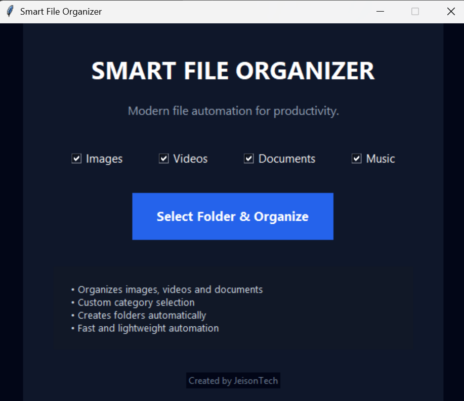
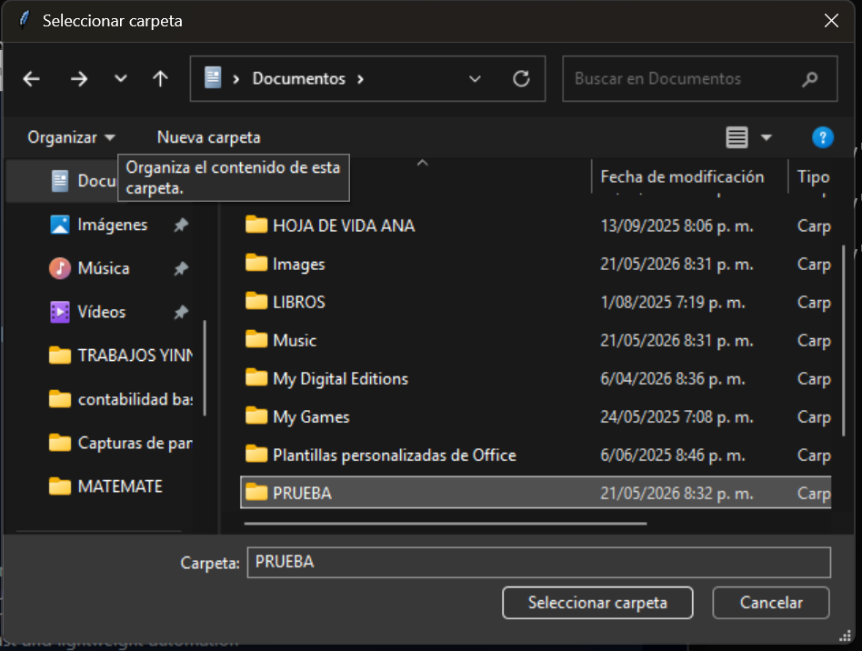
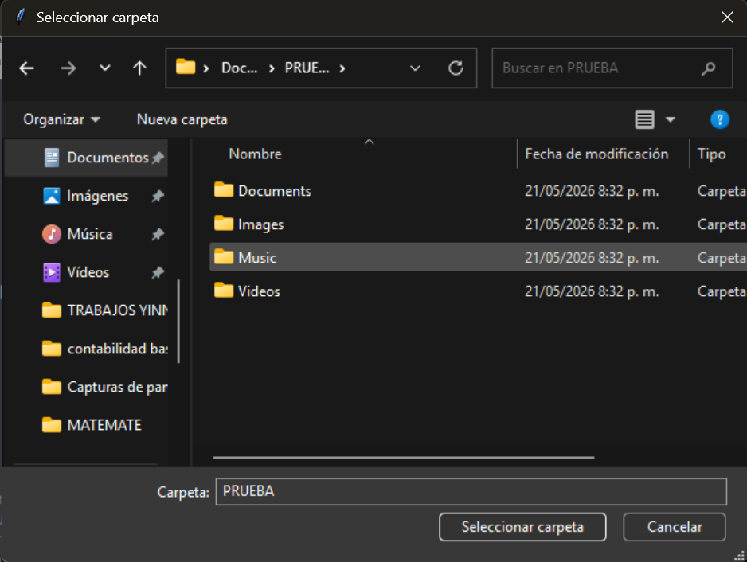

# Smart File Organizer

Modern desktop application built with Python and Tkinter for intelligent file organization and automation.

---

## Features

✅ Modern futuristic interface  
✅ Automatic file organization  
✅ Custom category selection  
✅ Organizes images, videos, music and documents  
✅ Creates folders automatically  
✅ Lightweight and fast  

---

## Technologies

- Python
- Tkinter
- OS Module
- Shutil Module

---

## Screenshots

### Main Interface



---

### Folder Selection



---

### Organization Complete



---

## Installation

Clone the repository:

```bash
git clone https://github.com/JEYSONTECH/smart-file-organizer.git
```

Run the application:

```bash
python main.py
```

---

## Author

JeisonTech

Freelance Developer focused on:
- Web Development
- Python Automation
- AI Solutions
